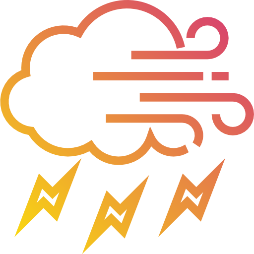

<p align="left">
  
</p>

# Weather App

A minimalistic weather application built with Next.js 16, TypeScript, and Tailwind CSS featuring elegant design, dynamic city images, and comprehensive weather data.

## ✨ Features

- **Minimalistic Design**: Clean, artistic interface with soft gradients and elegant typography
- **Dynamic City Images**: Beautiful cityscape photos that change based on selected location
- **City Overview Page**: View weather for all cities at once in a responsive grid
- **Detailed Forecast**: 3-day weather predictions with visual weather icons
- **Interactive UI**: City selection dropdown with instant weather updates
- **Reusable Components**: Modular, well-documented component architecture
- **Responsive Design**: Optimized for mobile, tablet, and desktop

## 🌍 Available Cities

- Durham, NC, USA
- New York, NY, USA
- Tokyo, Japan
- Accra, Ghana
- Lausanne, Switzerland
- Santorini, Greece

## 🚀 Getting Started

### Prerequisites
- Node.js 18+ installed
- npm or yarn package manager

### Installation

1. **Clone the repository**:
   ```bash
   git clone <repository-url>
   cd mapd-weather-app-class3
   ```

2. **Install dependencies**:
   ```bash
   npm install
   ```

3. **Add city images** (optional but recommended):
   - Create folder: `public/city-images/`
   - Add images: `durham.jpg`, `new-york.jpg`, `tokyo.jpg`, `accra.jpg`, `lausanne.jpg`, `santorini.jpg`
   - Recommended size: 1200x800px
   - See `CITY_IMAGES_SETUP.md` for detailed guide

4. **Run the development server**:
   ```bash
   npm run dev
   ```

5. **Open your browser** and navigate to [http://localhost:3000](http://localhost:3000)

## 📁 Project Structure

```
src/
├── app/
│   ├── page.tsx                      # Home page with weather display
│   └── weather/
│       ├── [location]/
│       │   └── page.tsx              # Detailed city weather page
│       └── all-cities/
│           └── page.tsx              # All cities overview page
├── components/
│   ├── CityPictureCard.tsx           # Dynamic city image display
│   ├── CurrentWeatherDetail.tsx      # Current weather details
│   ├── ErrorMessage.tsx              # Error state component
│   ├── ForecastCard.tsx              # 3-day forecast display
│   ├── LoadingState.tsx              # Loading state component
│   ├── LocationSearch.tsx            # City dropdown selector
│   ├── PageHeader.tsx                # Page header component
│   ├── WeatherCard.tsx               # Weather card component
│   ├── WeatherDisplay.tsx            # Main weather display
│   ├── WeatherIcon.tsx               # Weather condition icons
│   └── ui/
│       └── Button.tsx                # Reusable button with icon support
├── data/
│   ├── cities.ts                     # City coordinates (6 cities)
│   └── weather-data.ts               # Dummy weather data
├── lib/
│   └── getWeather.ts                 # Weather data retrieval logic
└── types/
    └── weather.ts                    # TypeScript type definitions
```

## 🎨 Design System

### Color Palette
- **Background**: Soft gradient from gray-50 to gray-100
- **Cards**: White with subtle shadows and borders
- **Primary Actions**: Black background with white text
- **Secondary Actions**: Gray text with hover effects
- **Accents**: Weather-specific (amber sun, blue rain, gray clouds)

### Typography
- **Font Weight**: Light (300) for minimalistic aesthetic
- **Tracking**: Tight for headlines, wide for labels
- **Sizes**: Responsive from mobile to desktop

### Components
- **Border Radius**: Generous (rounded-3xl) for modern look
- **Shadows**: Subtle for depth without distraction
- **Icons**: Thin stroke width (1.5) from lucide-react

## 🛠️ Key Technologies

- **Next.js 16**: React framework with App Router
- **TypeScript**: Type-safe development
- **Tailwind CSS**: Utility-first styling
- **Lucide React**: Minimalistic icon library
- **Next.js Image**: Optimized image loading

## 📚 Key Concepts Demonstrated

This project showcases:

- **Component Composition**: Building UIs from reusable, documented components
- **Props & State**: Passing data and managing interactive UI with React hooks
- **Dynamic Routes**: Next.js App Router with dynamic `[location]` parameter
- **Type Safety**: Comprehensive TypeScript interfaces throughout
- **Responsive Design**: Mobile-first approach with Tailwind breakpoints
- **Image Optimization**: Next.js Image component with lazy loading
- **Code Documentation**: Detailed comments explaining all changes and additions
- **Design Systems**: Consistent styling across all pages
- **Conditional Rendering**: Different UI states (loading, error, success)

## 🆕 Recent Updates

### New Components
- `CityPictureCard.tsx` - Dynamic city image display
- Updated `WeatherIcon.tsx` - Lucide React icons instead of emojis
- Enhanced `Button.tsx` - Icon support with flexible positioning

### New Pages
- `/weather/all-cities` - Overview grid of all cities with weather

### Design Overhaul
- Minimalistic black/white/gray color scheme
- Consistent card styling across all pages
- Enhanced buttons with icons (Eye, MapPin, Search)
- Improved typography and spacing

### Data Expansion
- Added 3 new cities: Accra, Lausanne, Santorini
- Comprehensive weather data for all 6 cities
- Realistic climate-appropriate data

## 🔧 Building for Production

```bash
# Build the application
npm run build

# Start production server
npm start
```

## 📖 Additional Documentation

- `CITY_IMAGES_SETUP.md` - Guide for adding city images
- `IMPLEMENTATION_SUMMARY.md` - Detailed changelog of all updates

## 🎯 Future Enhancements

- Real API integration (Open-Meteo or similar)
- User location detection
- Hourly forecast view
- Weather alerts and notifications
- Temperature unit toggle (°F/°C)
- More cities and locations

## 📝 License

This project is for educational purposes.

## 👨‍💻 Development Notes

All code includes detailed comments marking:
- `// NEW:` - Newly added code
- `// MODIFIED:` - Changed existing code
- Inline explanations for complex logic

This makes the codebase easy to understand and maintain for learning purposes.