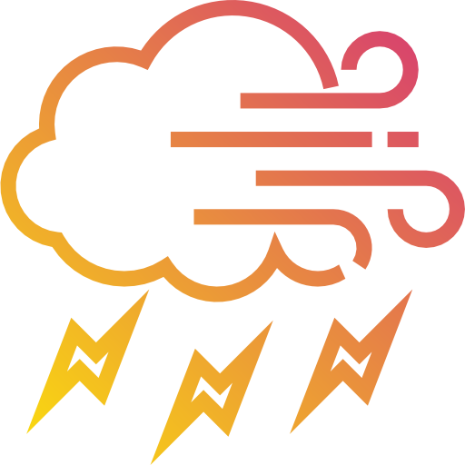

<p align="left">
  
</p>

# The 'Dev' Weather App

A minimalistic, everyday-use weather application built with Next.js 16, TypeScript, and Tailwind CSS. Search for any city worldwide, get real-time weather data, and see beautiful dynamic city images powered by Unsplash API.

## ✨ Features

### 🌟 New User Experience Updates
- **"Where are you?" Prompt**: Set your home location on first visit for instant weather display
- **Smart Search**: Search for any city worldwide with real-time geocoding
- **Dynamic City Images**: Powered by Unsplash API - beautiful photos for any searched city
- **Clickable Weather Cards**: Tap/click weather cards to view detailed forecasts
- **Home Location Memory**: Your location is saved locally for quick access
- **Durham Default**: Defaults to Durham, NC if no home location is set

### 🎨 Core Features
- **Minimalistic Design**: Clean, artistic interface designed for everyday use by all ages
- **Real-Time Weather**: Live data from Open-Meteo API for any location
- **Detailed Forecast**: 3-day weather predictions with visual weather icons
- **Dark/Light Theme**: Toggle between themes with persistent preference
- **Temperature Units**: Switch between Fahrenheit and Celsius
- **Responsive Design**: Optimized for mobile, tablet, and desktop
- **Reusable Components**: Modular, well-documented component architecture

## 🔍 Search Capabilities

- **Worldwide Search**: Find weather for any city globally (Paris, Tokyo, Sydney, etc.)
- **Geocoding Integration**: Automatic coordinate lookup for searched locations
- **Instant Results**: Fast API responses with loading states
- **Smart Fallback**: Local images used if Unsplash API is unavailable

## 🚀 Getting Started

### Prerequisites
- Node.js 18+ installed
- npm or yarn package manager
- (Optional) Free Unsplash API key for dynamic city images

### Installation

1. **Clone the repository**:
   ```bash
   git clone <repository-url>
   cd mapd-weather-app-class3
   ```

2. **Install dependencies**:
   ```bash
   npm install
   ```

3. **Set up Unsplash API** (optional but recommended):
   - Get your free API key from [Unsplash Developers](https://unsplash.com/developers)
   - Create a `.env.local` file in the project root:
     ```bash
     # On Windows:
     copy .env.local.example .env.local

     # On macOS/Linux:
     cp .env.local.example .env.local
     ```
   - Add your API key to `.env.local`:
     ```env
     NEXT_PUBLIC_UNSPLASH_ACCESS_KEY=your_actual_access_key_here
     ```
   - See [UNSPLASH_SETUP.md](docs/UNSPLASH_SETUP.md) for detailed instructions
   - **Note**: The app works perfectly without this - it will use local fallback images

4. **Run the development server**:
   ```bash
   npm run dev
   ```

5. **Open your browser** and navigate to [http://localhost:3000](http://localhost:3000)

6. **First-time setup**:
   - You'll see "Where are you?" prompt
   - Enter your city (e.g., "Durham", "London", "Tokyo")
   - Your location will be saved for future visits
   - Start searching for any city worldwide!

## 📁 Project Structure

```
src/
├── app/
│   ├── page.tsx                      # Home page with weather display
│   └── weather/
│       ├── [location]/
│       │   └── page.tsx              # Detailed city weather page
│       └── all-cities/
│           └── page.tsx              # All cities overview page
├── components/
│   ├── CityPictureCard.tsx           # Dynamic city image display
│   ├── CurrentWeatherDetail.tsx      # Current weather details
│   ├── ErrorMessage.tsx              # Error state component
│   ├── ForecastCard.tsx              # 3-day forecast display
│   ├── LoadingState.tsx              # Loading state component
│   ├── LocationSearch.tsx            # City dropdown selector
│   ├── PageHeader.tsx                # Page header component
│   ├── WeatherCard.tsx               # Weather card component
│   ├── WeatherDisplay.tsx            # Main weather display
│   ├── WeatherIcon.tsx               # Weather condition icons
│   └── ui/
│       └── Button.tsx                # Reusable button with icon support
├── data/
│   ├── cities.ts                     # City coordinates (6 cities)
│   └── weather-data.ts               # Dummy weather data
├── lib/
│   └── getWeather.ts                 # Weather data retrieval logic
└── types/
    └── weather.ts                    # TypeScript type definitions
```

## 🎨 Design System

### Color Palette
- **Background**: Soft gradient from gray-50 to gray-100
- **Cards**: White with subtle shadows and borders
- **Primary Actions**: Black background with white text
- **Secondary Actions**: Gray text with hover effects
- **Accents**: Weather-specific (amber sun, blue rain, gray clouds)

### Typography
- **Font Weight**: Light (300) for minimalistic aesthetic
- **Tracking**: Tight for headlines, wide for labels
- **Sizes**: Responsive from mobile to desktop

### Components
- **Border Radius**: Generous (rounded-3xl) for modern look
- **Shadows**: Subtle for depth without distraction
- **Icons**: Thin stroke width (1.5) from lucide-react

## 🛠️ Key Technologies

- **Next.js 16**: React framework with App Router
- **TypeScript**: Type-safe development
- **Tailwind CSS**: Utility-first styling
- **Lucide React**: Minimalistic icon library
- **Next.js Image**: Optimized image loading

## 📚 Key Concepts Demonstrated

This project showcases:

- **Component Composition**: Building UIs from reusable, documented components
- **Props & State**: Passing data and managing interactive UI with React hooks
- **Dynamic Routes**: Next.js App Router with dynamic `[location]` parameter
- **Type Safety**: Comprehensive TypeScript interfaces throughout
- **Responsive Design**: Mobile-first approach with Tailwind breakpoints
- **Image Optimization**: Next.js Image component with lazy loading
- **Code Documentation**: Detailed comments explaining all changes and additions
- **Design Systems**: Consistent styling across all pages
- **Conditional Rendering**: Different UI states (loading, error, success)

## 🆕 Latest Updates (December 2025)

### 🎯 Major User Experience Overhaul
- **Home Location Feature**: "Where are you?" prompt on first visit with localStorage persistence
- **Search-First Interface**: Replaced dropdown with dynamic search input for worldwide city lookup
- **Unsplash API Integration**: Dynamic city images fetched from Unsplash for any searched location
- **Clickable Weather Cards**: Cards now navigate to detailed forecast page with smooth animations
- **Smart Defaults**: Durham, NC as default location for new users

### 🔧 Technical Improvements
- **Geocoding Integration**: Real-time coordinate lookup for any city worldwide
- **Image Fallback System**: Graceful degradation to local images if Unsplash unavailable
- **Enhanced Error Handling**: Better user feedback with toast notifications
- **Improved Loading States**: Skeleton screens and spinners for better UX
- **Next.js Image Optimization**: Remote image pattern support for Unsplash

### 📦 New Files & Documentation
- `src/lib/unsplash.ts` - Unsplash API integration utility
- `docs/UNSPLASH_SETUP.md` - Comprehensive setup guide for API configuration
- `.env.local.example` - Environment variable template
- `docs/` - All documentation in one organized folder

## 🔧 Building for Production

```bash
# Build the application
npm run build

# Start production server
npm start
```

## 📖 Additional Documentation

All documentation is organized in the [`docs/`](docs/) folder:

- [QUICK_START.md](docs/QUICK_START.md) - Get running in 3 minutes
- [UNSPLASH_SETUP.md](docs/UNSPLASH_SETUP.md) - **NEW!** Complete guide for Unsplash API setup
- [UPDATE_SUMMARY_DEC2025.md](docs/UPDATE_SUMMARY_DEC2025.md) - Detailed changelog of latest updates
- [TESTING_CHECKLIST.md](docs/TESTING_CHECKLIST.md) - QA testing guide
- `CITY_IMAGES_SETUP.md` - Guide for adding local fallback city images
- `IMPLEMENTATION_SUMMARY.md` - Historical changelog

## 🎯 Completed Features ✅

- ✅ Real API integration (Open-Meteo for weather)
- ✅ Geocoding for any worldwide location
- ✅ Temperature unit toggle (°F/°C)
- ✅ Dark/Light theme toggle
- ✅ User home location with localStorage
- ✅ Dynamic city images via Unsplash API
- ✅ Clickable/tappable weather cards
- ✅ Worldwide city search

## 🚀 Future Enhancements

- Browser geolocation detection (auto-detect user's city)
- Hourly forecast view (12-24 hour predictions)
- Weather alerts and severe weather notifications
- Favorite cities list
- Weather comparison (multiple cities side-by-side)
- Share weather card as image
- Offline mode with cached data

## 📝 License

This project is for educational purposes.

## 👨‍💻 Development Notes

All code includes detailed comments marking:
- `// NEW:` - Newly added code
- `// MODIFIED:` - Changed existing code
- Inline explanations for complex logic

This makes the codebase easy to understand and maintain for learning purposes.