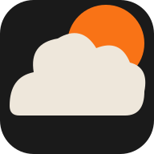

<p align="left">
  
</p>

# CityCast

> Weather, but not boring.

CityCast is a PWA-ready weather app built with Next.js 16 (App Router) and TypeScript. It gives you real-time weather, a timezone-aware task planner, saved places, and a fully themeable UI — all optimised for handheld devices.

---

## Features

### Weather
- Real-time conditions and 7-day forecast via Open-Meteo API
- Hourly forecast with precipitation probability
- Auto-detects location changes (travel detection) and prompts to switch city
- Weather-aware task planner — cross-checks your tasks against the sky

### Tasks
- Add tasks for today or any future date
- Native date + time pickers (15-min steps) synced to your chosen city's timezone
- Inline editing, weather status badges (Good / Heads Up / Reschedule?), overdue tracking
- Task count badge on the Tasks tab in the bottom nav

### Places
- Save multiple cities with local time and live weather
- Upload custom photos per city
- Set any city as home with one tap

### Design & Theming
- Three themes: Cream · Dark · Pastel
- Five accent colours: Orange · Coral · Lime · Violet · Sky
- Syne (display) + Space Grotesk (body) + JetBrains Mono (labels)
- Splash screen on every load, tied to weather fetch state

### PWA / Install
- Installable on iOS (Safari → Add to Home Screen) and Android (Chrome install banner)
- Runs standalone, full-screen, no browser chrome
- App icons at 192 × 192 and 512 × 512

---

## Getting Started

### Prerequisites
- Node.js 18+
- npm

### Install & run

```bash
# 1. Install dependencies
npm install

# 2. Copy env template and add your Open-Meteo key if needed
cp .env.local.example .env.local

# 3. Start dev server
npm run dev
```

Open [http://localhost:3000](http://localhost:3000) — you'll be prompted to set your home city on first visit.

### Build for production

```bash
npm run build
npm start
```

---

## Project Structure

```
src/
├── app/
│   ├── page.tsx                  # Home — current conditions
│   ├── hourly/page.tsx           # Hourly forecast
│   ├── 7-day/page.tsx            # 7-day forecast
│   ├── plan/page.tsx             # Tasks (weather-aware planner)
│   ├── places/page.tsx           # Saved cities
│   ├── calendar/page.tsx         # Calendar view
│   ├── settings/page.tsx         # Theme, accent, home city
│   └── weather/[location]/       # City detail page
├── components/
│   ├── BottomNav.tsx             # Tab bar with dynamic calendar icon
│   ├── CCHeader.tsx              # Brand + °F/°C + theme toggle
│   ├── SplashScreen.tsx          # Load screen (every visit)
│   ├── ClientLayout.tsx          # Splash gate tied to weather fetch
│   ├── WeatherIcon.tsx           # SVG weather condition icons
│   └── ...
├── contexts/
│   ├── WeatherContext.tsx        # Weather data + travel detection
│   ├── TaskContext.tsx           # Tasks + timezone-aware today logic
│   ├── ThemeContext.tsx          # Theme / accent state
│   └── TemperatureContext.tsx    # °F / °C toggle
├── lib/
│   ├── getWeather.ts             # Open-Meteo API calls
│   ├── geocode.ts                # City → coordinates
│   └── copy.ts                   # Weather condition labels + copy
└── types/
    └── weather.ts                # TypeScript interfaces
```

---

## Tech Stack

| | |
|---|---|
| Framework | Next.js 16 (App Router) |
| Language | TypeScript |
| Styling | Inline CSS-in-JS (runtime theming) + Tailwind base |
| Fonts | Syne · Space Grotesk · JetBrains Mono (Google Fonts) |
| Weather API | Open-Meteo (free, no key required) |
| Geocoding | Open-Meteo Geocoding API |
| Icons | Hand-crafted SVG |
| PWA | Web App Manifest + sharp-generated icons |

---

## Brand Assets

Design assets live in `Weather App Redesign/brand/`:

| File | Description |
|---|---|
| `icon-mark.svg` / `.png` | Standalone CityCast icon (transparent bg) |
| `logo.svg` / `.png` | Horizontal lockup — icon + CITYCAST wordmark |
| `BRAND_KIT.md` | Colours, fonts, voice & tone, spacing tokens |

Run `node export-pngs.js` inside that folder to regenerate the PNGs.

---

## License

Educational use. Built by @theoriginalmapd.
